# Konfigurasi-Web-Server-mengunakan-Apache2-pada-Debian-10
Sabtu 27 September 2025  
  
# Pendahuluan
  Apache2 merupakan perangkat lunak open-source yang berfungsi untuk melayani permintaan (request) dari klien melalui protokol HTTP (Hypertext Transfer Protocol). Server ini akan mengirimkan kembali respons berupa halaman web kepada klien, biasanya berupa dokumen HTML, gambar, atau skrip web.  
    
# Langkah konfigurasi Web Server dengan Apache2  
1. Langkah pertama yang harus kita lakukan adalah melakukan instalasi Apache2.  
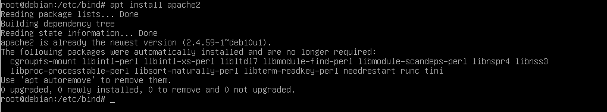  
2. Setelah proses instalasi, untuk melihat apakah apache2 sudah berjalan atau belum, gunakan.  

       systemctl status apache2
   Jika status menunjukan **active (running)**, berarti apache2 sudah berjalan.  
3. Selanjutnya kita perlu mengkonfigurasi IP statis untuk interface host-only. Buka file konfigurasi dengan.  

       nano /etc/network/interfaces
   Lalu tambahkan konfigurasi berikut.  
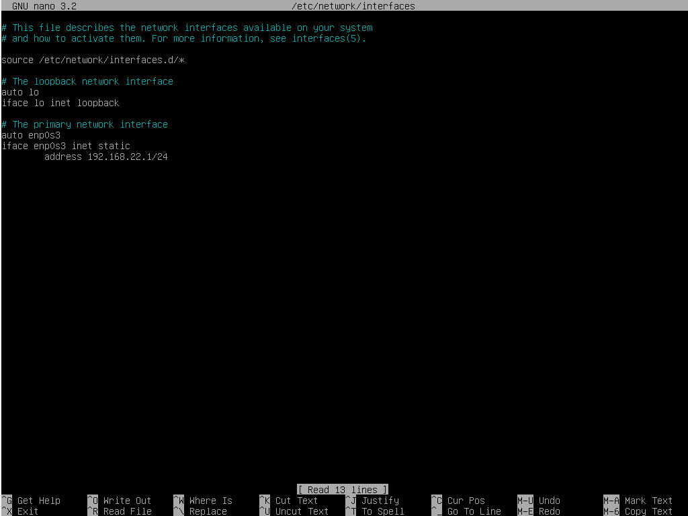  
   Jika sudah, jangan lupa untuk merestart service networknya,  

       systemctl restart networking
   dan pastikan juga alamat IP nya sudah terpasang.  
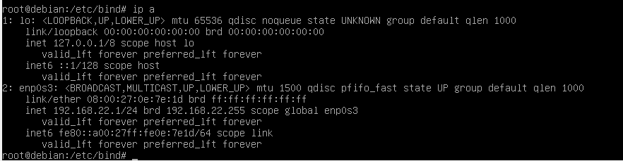  
5. Sekarang kita pindah dulu ke Windows untuk mengubah IP nya agar satu segmen dengan IP Debian.  
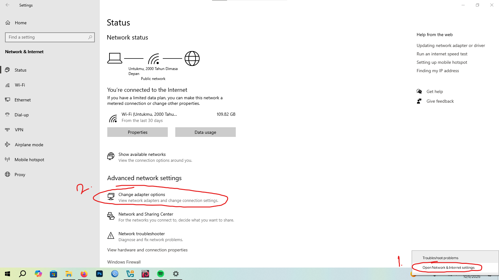  
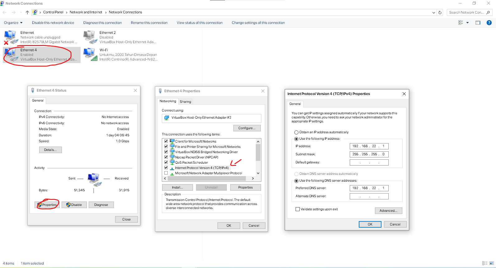  
6. Jika sudah, sekarang buka web browser lalu ketik alamat IP servernya, Jika berhasl akan munbul tampilan awal apache2.  
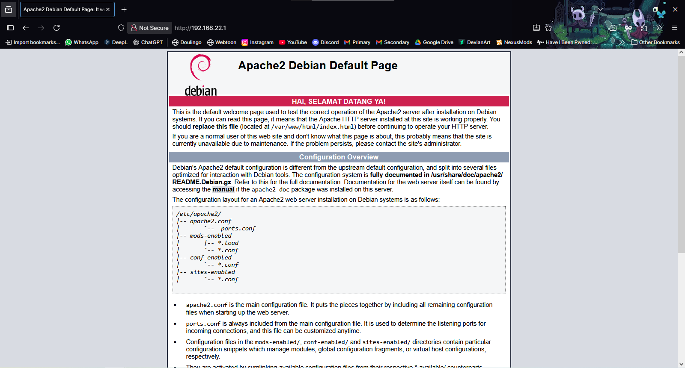  
7. Selanjutnya, kita lanjut konfigurasi webservernya. Untuk menampilkan halaman web kita, diperlukan pembuatan dir dan file HTML di direktori utama web server. Kita buat direktori baru di **/var/www**.  
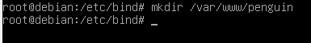  
8. Lalu di dalam folder itu kita perlu membuat index.html. Pertama masuk dulu ke folder yang sudah dibuat tadi (cd penguin). Lalu buat html di dalamnya.  

       nano index.html
   Isi file HTML nya sesuai keinginan kita.  
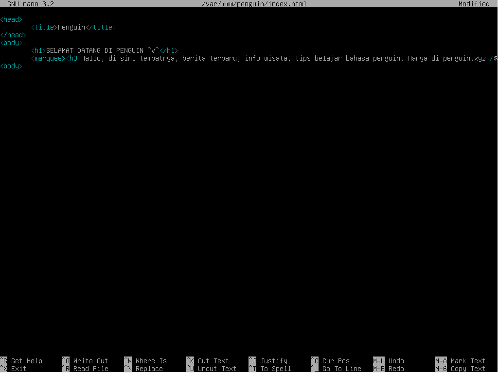  
9. Selanjutnya agar Apache2 dapat mengenali direktori web yang baru kita buar, kita perlu buat file Virtual Host Configuration di direktori /etc/apache2/sites-available. Pertama kita masuk dulu ke dir konfigurasi (cd /etc/apache2/sites-available), di sana akan ada file 000-default.conf, kita bisa copy kan saja lalu nantinya edit untuk web yang akan kita buat.  
  
10. Berikut konfigurasi file Virtual Host nya, isinya sesuaikan dengan web servernya.  
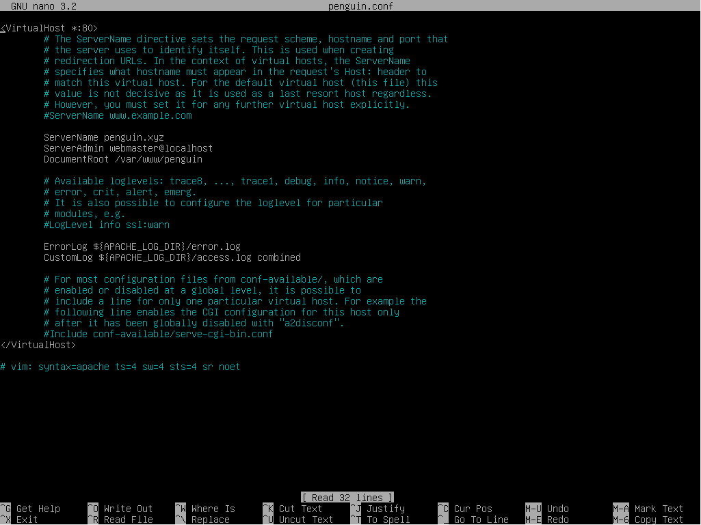  
11. Jika sudah jangan lupa save (CTRL + X, Y lalu Enter). Jika sudah kita cek di /etc/apache2/sites-enabled apakah ada isinya (dengan ls), jika ada kita matikan dulu agar nantinya tidak tabrakan dengan yang kita buat, untuk mematikan bisa menggunakan **a2dissite 000-default.conf**. Jika sudah kita nyalakan Virtual Host yang kita buat tadi dengan **a2ensite penguin.conf** lalu reload service apache2nya.  
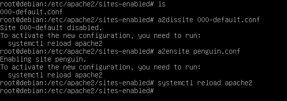  
12. Jika sudah, kita bisa langsung tes mengunakan browser, ketik IP Servernya, dan domainnya jika menggunakan DNS. Jika berhasil, HTML yang kita buat tadi akan muncul.  
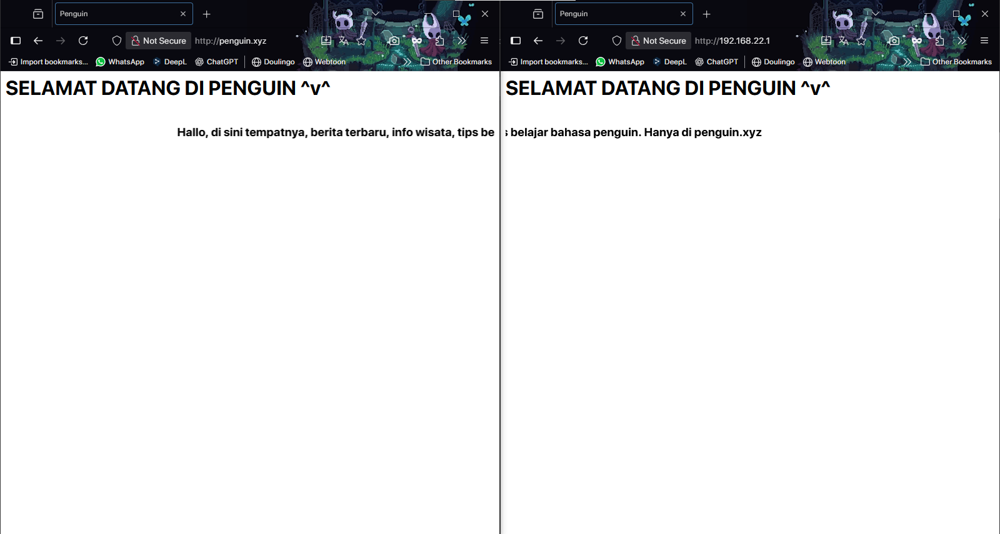  
    
# Troubleshooting  
  Jika halaman web tidak dapat diakses, beberapa langkah pemeriksaan yang dapat dilakukan antara lain:  
  1. Pastikan Apache2 service berjalan, cek dengan **systemctl status apache2**.  
  2. Periksa konfigurasi IP menggunakan **ip a** dan pastikan alamat IP sudah sesuai.  
  3. Cek file log apache2 di /var/log/apache2/error.log  
  4. Jika halaman web tampil saat search mengunakan IP tapi saat mengunakan domain malah muncul default apache2, **hapus** file 000-default.conf di **/etc/apache2/sites-available** (backup dulu jika sekiranya perlu), dan pastikan juga hanya ada satu file di **sites-enabled**.  
  
# Kesimpulan
  Apache2 berhasil dijalankan sebagai web server pada sistem operasi Debian 10. Dengan melakukan instalasi, pengaturan IP statis, serta pembuatan Virtual Host, server dapat melayani permintaan web dari klien melalui jaringan lokal. Hasil pengujian menunjukkan bahwa halaman web yang dibuat dapat diakses dengan baik melalui browser host.  
